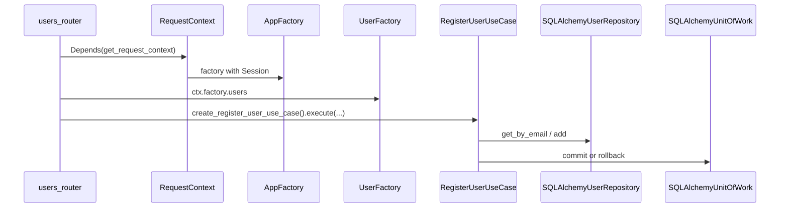

# FastAPI Hexagonal Architecture Example

A small FastAPI service organized by **bounded contexts** (`users`, `posts`) and **shared** cross-cutting infrastructure. The codebase follows **hexagonal (ports & adapters)** layering: **domain**, **application** (ports + use cases), and **infrastructure** (HTTP, SQLAlchemy persistence).

## When this architecture pays off

For a toy CRUD API, this structure is **deliberately more than you need**. Folders, factories, and ports add ceremony compared to a single `routes.py` and raw SQLAlchemy calls.

It starts to earn its keep as the system grows:

- **Separation of concerns**: business rules live in the domain and use cases; HTTP and the database are details behind interfaces.
- **Testability**: use cases can be tested **without** a database by swapping **in-memory** or fake implementations of ports.
- **Evolving delivery**: you can change persistence, add another API surface, or extract a service later without rewriting core logic—**if** boundaries stay honest.
- **Enforced boundaries**: [import-linter](https://import-linter.readthedocs.io/) and [`scripts/lint_architecture.py`](scripts/lint_architecture.py) help keep **application** code from depending on **infrastructure** and keep **domain** code from importing other layers.

Use your judgment: adopt the full scaffold for learning or for codebases that will grow; skip layers you do not need for throwaway scripts.

## Prerequisites

- **Python 3.11+**
- **[uv](https://docs.astral.sh/uv/)** (recommended) or pip

### Install uv

```bash
# macOS/Linux
curl -LsSf https://astral.sh/uv/install.sh | sh

# Or with Homebrew (macOS)
brew install uv
```

## Quick start

From the project root:

1. **Install dependencies**

```bash
 uv sync
```

This creates a `.venv`, resolves dependencies into `uv.lock`, and installs the project in editable mode (including dev dependencies: pytest, [Ruff](https://docs.astral.sh/ruff/), import-linter). 2. **Environment**

```bash
 cp .env.example .env
```

Defaults use **SQLite** (`DATABASE_URL=sqlite:///./app.db` in `[.env.example](.env.example)`). Adjust `APP_NAME`, `DATABASE_URL`, or `DB_ECHO` if needed. 3. **Run the app**

```bash
 uv run uvicorn src.shared.main:app --reload
```

- API: `http://127.0.0.1:8000`
- OpenAPI UI: `http://127.0.0.1:8000/docs`

## Commands

| Command                                       | Description                                                                                                               |
| --------------------------------------------- | ------------------------------------------------------------------------------------------------------------------------- |
| `uv sync`                                     | Install or update dependencies from `pyproject.toml` / `uv.lock`                                                          |
| `uv run uvicorn src.shared.main:app --reload` | Dev server with auto-reload                                                                                               |
| `uv run pytest`                               | Run the test suite                                                                                                        |
| `uv run ruff check .`                         | Lint (rules in `[pyproject.toml](pyproject.toml)` → `[tool.ruff]`)                                                        |
| `uv run ruff check . --fix`                   | Lint with safe auto-fixes                                                                                                 |
| `uv run ruff format .`                        | Format with Ruff’s formatter                                                                                              |
| `uv run python scripts/lint_architecture.py`  | import-linter **plus** domain isolation AST check (see [Tooling and architecture rules](#tooling-and-architecture-rules)) |
| `uv run lint-imports`                         | import-linter only; skips the domain script                                                                               |
| `uvx ty check`                                | Run type checking                                                                                                         |

Typical pre-commit: `uv run ruff check . --fix`, `uv run ruff format .`, `uv run pytest`, and optionally `uv run python scripts/lint_architecture.py`.

## API overview

| Method   | Path                          | Description            |
| -------- | ----------------------------- | ---------------------- |
| `POST`   | `/users`                      | Register a user        |
| `GET`    | `/users/{user_id}`            | Get user by id         |
| `DELETE` | `/users/{user_id}`            | Delete user            |
| `GET`    | `/users/{user_id}/posts`      | List posts for a user  |
| `GET`    | `/users/{user_id}/with-posts` | User with nested posts |
| `POST`   | `/posts`                      | Create a post          |
| `GET`    | `/posts/{post_id}`            | Get post by id         |
| `DELETE` | `/posts/{post_id}`            | Delete post            |

## Rules
> A gateway only calls a use_case, the local gateway calls it directly, the http gateway calls an endpoint that calls the use_case. If should use local or http gateway is decided by settings.

> A use_case can call other gateways and its own repository

## Concepts

### Hexagonal architecture (ports and adapters)

Hexagonal architecture (also called **ports and adapters**) keeps **business logic** in the center and treats everything outside—HTTP, SQL, message queues, third-party APIs—as **replaceable plumbing**.

**The core**  
Here, the **domain** (entities, invariants, domain errors) and **application** (use cases orchestrating those rules) form the center. They encode _what the product does_ and _what must stay true_, independent of FastAPI or SQLAlchemy.

**Ports**  
A **port** is an interface the core needs in order to talk to the outside world **without** knowing the implementation. In this repo, outbound ports are mostly [`typing.Protocol`](https://docs.python.org/3/library/typing.html#typing.Protocol) definitions—for example [`UserRepository`](src/users/application/ports/user_repository.py) (persistence) and [`UnitOfWork`](src/shared/application/ports/unit_of_work.py) (transaction boundary). Use cases depend on these types only.

**Adapters**  
An **adapter** is the real implementation of a port, living in **infrastructure**. It translates between **domain objects** and **framework types**: e.g. [`SQLAlchemyUserRepository`](src/users/infrastructure/persistence/repository.py) maps `User` ↔ `UserORM`, and [`SQLAlchemyUnitOfWork`](src/shared/infrastructure/persistence/unit_of_work.py) maps `commit`/`rollback` ↔ SQLAlchemy [`Session`](https://docs.sqlalchemy.org/en/20/orm/session_api.html). The HTTP layer is another set of adapters: routers and Pydantic models adapt **HTTP** to **use case** inputs and outputs.

**Inbound vs outbound**

- **Inbound (driving) adapters** trigger behavior: e.g. a FastAPI route calls `RegisterUserUseCase.execute(...)`. The “port” on this side is effectively the **use case API** your delivery mechanism invokes.
- **Outbound (driven) adapters** are called **by** the core: repositories, unit of work, future integrations. They **implement** ports declared in `application/ports/`.

**Dependency direction**  
**Infrastructure depends on application/domain; not the other way around.** The core never imports FastAPI or SQLAlchemy. That is what makes swapping SQLite for Postgres, or REST for CLI, a wiring change instead of a rewrite—**if** you keep new code behind ports.

**Why “hexagonal”?**  
The shape is only a metaphor: many adapters can plug into the same core. The number of sides is arbitrary; the rule is **stable core, swappable edges**.

### Vertical slicing

**Vertical slicing** means organizing code by **feature or capability** (a “slice” through the stack) rather than only by **technical layer** (all controllers together, all repositories together).

In this project, each slice is a **bounded context** package under `src/`—for example [`src/users/`](src/users/) and [`src/posts/`](src/posts/). Inside each slice you still have **horizontal** layers (`domain`, `application`, `infrastructure`), but everything that belongs to “users” lives under one tree, end to end. That makes it easier to reason about **one capability**, navigate related code, and evolve or test it with less cross-folder archaeology.

[`src/shared/`](src/shared/) plays the role of a **shared kernel**: settings, DB session wiring, HTTP request context, and ports like `UnitOfWork` that slices reuse without duplicating infrastructure.

Contrast with a **purely horizontal** layout (e.g. a single `api/`, `services/`, `repositories/` tree): changes to one feature often scatter across unrelated folders; vertical slices keep the **feature boundary** explicit alongside **hexagonal** boundaries.

### Screaming architecture

Package and folder names **describe intent** first: `domain`, `application`, `infrastructure`, and bounded-context names (`users`, `posts`) under `src/`. You can navigate the tree without reading implementation details to see what the system is about.

### Factory pattern (composition root)

Endpoints do not construct repositories or use cases by hand. `[AppFactory](src/shared/infrastructure/http/factory.py)` holds per-context factories (`[UserFactory](src/users/infrastructure/http/factory.py)`, `[PostFactory](src/posts/infrastructure/http/factory.py)`) that wire **one SQLAlchemy `Session` per request** into concrete adapters and use cases. That wiring is the **composition root**: the only place that knows which adapter implements which port.

## Layers (in this repository)

### Domain (`src/<bounded_context>/domain/`)

- **Entities** and **value objects** (e.g. `[User](src/users/domain/user.py)`, `[Post](src/posts/domain/post.py)`).
- **Domain exceptions** (e.g. `[UserNotFoundException](src/users/domain/exceptions.py)`)—business failures, not HTTP.
- Must not import `application` or `infrastructure` from `src` (enforced by `scripts/lint_architecture.py` for `src/<bc>/domain/`).

### Application (`src/<bounded_context>/application/`)

- **`ports/`**: contracts (`Protocol`) that use cases need—repositories, [`UnitOfWork`](src/shared/application/ports/unit_of_work.py) in `shared`, etc.
- **`use_cases/`**: one class per scenario with an `execute(...)` method, depending **only** on ports and domain types—e.g. [`RegisterUserUseCase`](src/users/application/use_cases/register_user.py) takes `UserRepository` and `UnitOfWork`, not `Session`.

### Infrastructure (`src/<bounded_context>/infrastructure/`)

- **`http/`**: FastAPI routers, Pydantic request/response models, and the bounded-context **factory** that builds use cases for a request.
- **`persistence/`**: SQLAlchemy ORM models ([`orm.py`](src/users/infrastructure/persistence/orm.py)), repository **adapters** ([`repository.py`](src/users/infrastructure/persistence/repository.py)).

`[src/shared/infrastructure/](src/shared/infrastructure/)` holds cross-cutting pieces: settings, DB session helper, HTTP `RequestContext`, and the top-level `[AppFactory](src/shared/infrastructure/http/factory.py)`.

## Repositories and Unit of Work

**Repository (port)**  
Defines persistence operations the use case needs, in **domain** terms: `User`, not `UserORM`.

**Repository (adapter)**  
Implements the port with SQLAlchemy: maps rows to domain (`_to_domain`), executes queries, and uses the shared `Session`.

**Unit of Work**  
The `[UnitOfWork](src/shared/application/ports/unit_of_work.py)` port exposes `commit()` and `rollback()`. `[SQLAlchemyUnitOfWork](src/shared/infrastructure/persistence/unit_of_work.py)` delegates to `[Session](https://docs.sqlalchemy.org/en/20/orm/session_api.html)`. Use cases that **mutate** state (e.g. `[RegisterUserUseCase](src/users/application/use_cases/register_user.py)`) call `commit()` after a successful write and `rollback()` if something fails—keeping transaction boundaries in the application layer while the adapter stays thin.

## Scaffolding per bounded context

Typical layout (repeat per context under `src/`):

| Location                                           | Role                                                |
| -------------------------------------------------- | --------------------------------------------------- |
| `domain/`                                          | Entities and domain exceptions                      |
| `application/ports/`                               | `Protocol` definitions (repositories, etc.)         |
| `application/use_cases/`                           | Orchestration; depends only on ports + domain       |
| `infrastructure/persistence/orm.py`                | SQLAlchemy table mappings                           |
| `infrastructure/persistence/repository.py`         | Port implementations                                |
| `infrastructure/http/requests.py` / `responses.py` | API DTOs                                            |
| `infrastructure/http/router.py`                    | Thin handlers; map domain exceptions to HTTP status |
| `infrastructure/http/factory.py`                   | Wire use cases for this context for one `Session`   |

**Adding a new top-level package** under `src/`: register it in the `containers` list in `[pyproject.toml](pyproject.toml)` (`[tool.importlinter]`) so layer contracts apply.

### Request flow (example: register user)



Routers are registered in `[src/shared/main.py](src/shared/main.py)`. `[get_request_context](src/shared/infrastructure/http/dependencies.py)` builds `[RequestContext](src/shared/infrastructure/http/context.py)` with the FastAPI `Request`, a DB `Session`, and `[AppFactory](src/shared/infrastructure/http/factory.py)`.

### Composite read models

Endpoints that return data spanning contexts (e.g. user with posts) may compose use cases that take multiple repositories in the same factory (`[UserFactory](src/users/infrastructure/http/factory.py)`) and reuse HTTP response types across routers where practical. Keep **domain exceptions** aligned with what each use case actually raises; avoid catching another bounded context’s exceptions in a handler unless that is part of the use case contract.

## Testing

Tests mirror the architecture:

| Style                      | What                                                                                                                                    | Example                                                                                                                    |
| -------------------------- | --------------------------------------------------------------------------------------------------------------------------------------- | -------------------------------------------------------------------------------------------------------------------------- |
| **Use case (fast, no DB)** | Instantiate the use case with **fakes**: in-memory repositories and a no-op UoW from `[tests/users/doubles.py](tests/users/doubles.py)` | `[test_register_user.py](tests/users/application/use_cases/test_register_user.py)`                                         |
| **Factories**              | Real SQLAlchemy `Session` via fixtures                                                                                                  | `[test_users_factory.py](tests/users/infrastructure/http/test_users_factory.py)`                                           |
| **Persistence**            | ORM and repository adapters against SQLite                                                                                              | `[tests/users/infrastructure/persistence/](tests/users/infrastructure/persistence/)`                                       |
| **HTTP**                   | `TestClient` with `app` / `client` fixtures from `[tests/conftest.py](tests/conftest.py)`                                               | `[test_users_router.py](tests/users/infrastructure/http/test_users_router.py)`, `[test_main.py](tests/test_main.py)`       |
| **Ports**                  | Lightweight structural checks                                                                                                           | `[tests/users/application/ports/test_user_repository_port.py](tests/users/application/ports/test_user_repository_port.py)` |

`[tests/conftest.py](tests/conftest.py)` uses a **file-based SQLite** URL per test run so engines and sessions behave consistently; `reset_get_settings_cache` clears `[get_settings](src/shared/infrastructure/settings.py)` around tests that patch `DATABASE_URL`.

Run everything with `uv run pytest`.

## Tooling and architecture rules

**Ruff** lints and formats the tree. Configuration: `[pyproject.toml](pyproject.toml)` (`[tool.ruff]`, `[tool.ruff.lint]`, `[tool.ruff.format]`): Python 3.11, 100-character lines, double quotes. The `docs/` folder is excluded; rule `B008` is ignored so FastAPI `Depends(...)` in defaults is allowed.

[`scripts/lint_architecture.py`](scripts/lint_architecture.py) runs:

1. **import-linter** — **Layers** per bounded context (`src.posts`, `src.users`, `src.shared`): allowed direction **infrastructure → application → domain** (`shared` may omit `application`). **Forbidden**: `src.*.application` must not import `src.*.infrastructure`.
2. **Domain isolation** — Under `src/<bc>/domain/`, imports from `src` are limited to `src.<bc>.domain` and `src.shared.domain` (stdlib and third-party unchanged).

`uv run lint-imports` runs only import-linter. Use `uv run python scripts/lint_architecture.py` for the full check.

## Project layout

- `[src/](src/)` — Bounded contexts (`users`, `posts`) and `shared` (settings, DB, HTTP context, shared ports)
- `[src/shared/main.py](src/shared/main.py)` — monolith `create_app()`, lifespan (engine, session factory), router includes; split deploys use `[src/users/main.py](src/users/main.py)` and `[src/posts/main.py](src/posts/main.py)`
- `[tests/](tests/)` — Pytest layout mirroring `src/` (use cases, persistence, HTTP, doubles)
- `[docs/](docs/)` — Design notes not shipped as package code (e.g. `[docs/design_notes_monolith_vs_microservices.py](docs/design_notes_monolith_vs_microservices.py)`)
- `[scripts/lint_architecture.py](scripts/lint_architecture.py)` — Architecture lint script

## Troubleshooting

- **SQLite file**: default `./app.db` relative to the process working directory when using `sqlite:///./app.db`. Run the app from the repo root or set an absolute `DATABASE_URL`.
- **Tests**: `[conftest.py](tests/conftest.py)` sets `DATABASE_URL` to a temp file SQLite database for isolation.

## License

MIT
