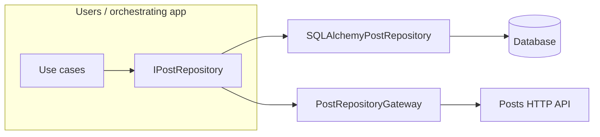

# Microservices in this repo (what actually changed)

This project still follows **hexagonal architecture**: the application layer depends on `IPostRepository`, not on SQL or HTTP. To run the **posts** bounded context as a separate process, we did **not** redesign the domain or use cases. We added **another adapter** for the same port and **switched which implementation** gets injected at runtime.

## The two files that matter

1. **`src/posts/infrastructure/http/post_repository_gateway.py`**  
   A new `PostRepositoryGateway` class that implements `IPostRepository` by calling the posts HTTP API (`httpx`). Same methods as the SQL repository from the use cases’ point of view: `add`, `get_by_id`, `list_by_user_id`, `delete`. Responses are mapped into the existing `Post` model (reusing `PostResponse` for validation).

2. **`src/shared/infrastructure/http/dependencies.py`**  
   The composition root for each request: if `post_service_external` is true, build a `PostRepositoryGateway` with the shared async client and `posts_service_base_url`; otherwise keep `SQLAlchemyPostRepository(session)`. Everything upstream (`AppFactory`, `PostFactory`, `UserFactory`, use cases) still receives `IPostRepository` and stays unchanged in spirit.

That is the **substance** of the microservice split: **same repository port, HTTP implementation instead of SQL** when configured.

## Everything else is boilerplate and wiring

The following supports deployment and configuration but does not change the hexagonal story:

- **Settings** (`post_service_external`, `posts_service_base_url`) — feature flag and base URL for the posts service.
- **`main.py`** — shared DB bootstrap; optional shared `httpx` client in app lifespan when talking to an external posts service; **omit** mounting the posts router on the “monolith” app when posts are external (users API still needs a post repository for cross-context use cases).
- **`PostFactory` / `UserFactory` / `AppFactory`** — constructors now take `post_repository: IPostRepository` so the same factories work with either adapter (injection, not new business logic).
- **`src/shared/infrastructure/http/client.py`** — small helper for a shared `AsyncClient` (timeouts, one client per app).
- **Docker / Compose** — two images or run modes from the **same codebase** (e.g. monolith on one port, posts API on another), shared volume for SQLite if you keep one logical database file, environment variables to flip `POST_SERVICE_EXTERNAL` and point at `http://posts:8001`.
- **Tests** — gateway behavior and factory wiring.

So: **one new HTTP adapter + one place that chooses SQL vs HTTP**. The rest is how you run and configure that choice.

## Mental model

Locally or in a single process you can keep `post_service_external=false` and use the SQL adapter only. With `post_service_external=true`, the same use cases talk to posts **over HTTP** while the port and domain stay the same.
